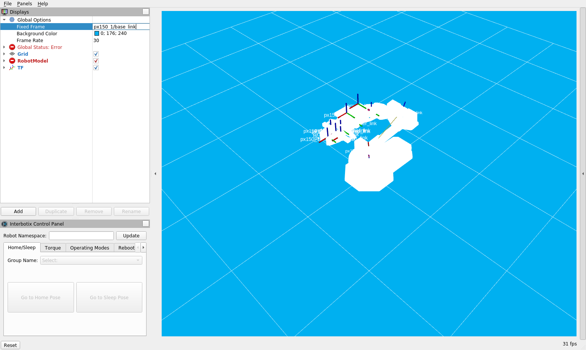

# Running

## Configuration

These instructions are not needed if the Docker file is used.

It is assumed that the ROS2 workspace is in ``/root/work``.

The AprilTag library and its ROS2 node implementation are required:

~~~
cd /root/work &&\
git clone https://github.com/AprilRobotics/apriltag.git &&\
git clone https://github.com/Interbotix/apriltag_ros.git -b ros2-port
~~~

Then compile all the packages:

~~~
cd /root/work &&\
colcon build --packages-select apriltag &&\
colcon build --packages-select apriltag_ros &&\
colcon build --packages-select esp32cam_driver &&\
colcon build --packages-select target_practice &&\
~~~

AprilTag detection must be configured for the correct tags. The configuration
files are provided in ``apriltag_ros_config``. These must be copied into
``install/apriltag_ros/share/apriltag_ros/config/``.

## With real hardware

The udev rules must be configured to pick up the interbotix arms and assign specific devices.

Example:

~~~
# U2D2 board (also sets latency timer to 1ms for faster communication)
SUBSYSTEM=="tty", ATTRS{idVendor}=="0403", ATTRS{idProduct}=="6014",
	ATTRS{serial}=="FT7923G0", ENV{ID_MM_DEVICE_IGNORE}="1",
	ATTR{device/latency_timer}="1", SYMLINK+="ttyDXL1"
SUBSYSTEM=="tty", ATTRS{idVendor}=="0403", ATTRS{idProduct}=="6014",
	ATTRS{serial}=="FT792AA0", ENV{ID_MM_DEVICE_IGNORE}="1",
	ATTR{device/latency_timer}="1", SYMLINK+="ttyDXL2"
~~~

If using ``esp32 camera`` determine its IP address, e.g. connect over ``screen`` to the tty device,
reset the camera and observe the IP.

1. Run the local launch file. This contains the hardware drivers and an arm controller that
provides services to move the arm:

~~~
ros2 launch target_practice arm_controller_launch_with_camera_espcam.py\
	robot_config:=/root/work/px150_1.yaml\
	robot_name:=px150_1\
	camera_ip:="192.168.0.103"
~~~

__OBS__ replace the ``camera_ip`` parameter.

2. Run the remote launch file. This contains the AprilTag detector and application controller:

~~~
ros2 launch target_practice robot_remote_launch_closed.py
~~~

## Simulating

It is possible to simulate the entire process of target detection by

* using the interbotix simulator
* using a ros2 bag to replace the camera data.

The ros2 bag for the camera must be placed in the ``espcam_target_practice_bag`` folder in the 
root of the workspace.

1. Run the local launch file, enabling simulation of the robot arm, and replay of camera data:

~~~
ros2 launch target_practice arm_controller_launch_with_camera_espcam.py\
	robot_config:=/root/work/px150_1.yaml robot_name:=px150_1\
	camera_ip:="192.168.0.103"\
	replay:=true use_sim:=true use_rviz:=true
~~~

The last line is the important one.

The ``rviz2`` simulator will run, showing the 3D model of the robot arm. To properly visualise it
you may need to set the value of the "Fixed frame" to ``"px150_1/base_link"``:

{ height=300px }

2. Run the remote launch file as detailed above.

3. Start a single detection:

* run the single detection node: ``ros2 run target_practice single_detection``
* call the single detection service: `` ros2 service call /single_detection example_interfaces/srv/Trigger``

The camera driver will replay the images previously recorded, and the robot will follow the 
previous path.
